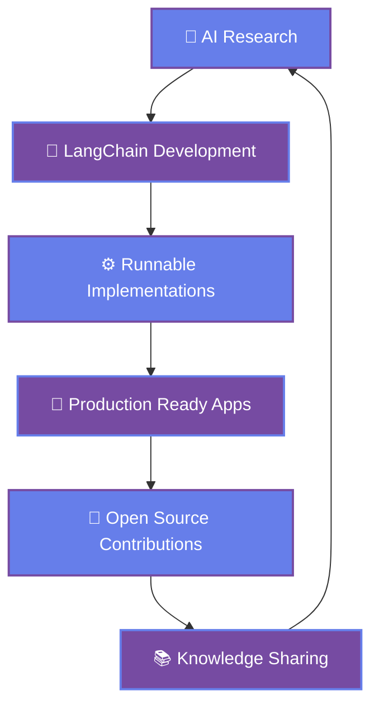

<div align="center">
  
</div>

# 👋 Hey there! I'm Anvesha (Void-Anvesha)

<div align="center">
  
[](https://git.io/typing-svg)

<p>
  
  
  
</p>

</div>

---

## 🚀 About Me

```python
class VoidAnvesha:
    def __init__(self):
        self.name = "Anvesha"
        self.role = "AI/ML Developer & LangChain Specialist"
        self.location = "🌍 Earth (Remote Ready)"
        self.interests = [
            "Machine Learning", "LangChain", "NLP", 
            "Deep Learning", "RAG Systems", "AI Agents"
        ]
        self.currently_working_on = "LangChain Runnable Implementations"
        self.learning = [
            "Advanced AI Architectures", "MLOps", 
            "Vector Databases", "Multi-Agent Systems"
        ]
        self.tech_stack = {
            "languages": ["Python", "JavaScript", "SQL"],
            "ai_ml": ["LangChain", "PyTorch", "TensorFlow", "Hugging Face"],
            "cloud": ["AWS", "Docker", "FastAPI"],
            "databases": ["PostgreSQL", "Pinecone", "ChromaDB"]
        }
        self.fun_fact = "I turn coffee into code and ideas into reality ☕➡️💻"
        self.motto = "Building AI that makes a positive impact 🌟"
    
    def get_current_status(self):
        return {
            "🔭 Working on": "Advanced RAG implementations",
            "🌱 Learning": "Multi-agent AI architectures",
            "👯 Looking to collaborate": "Open-source AI projects",
            "💬 Ask me about": "LangChain, AI/ML, Python"
        }
    
    def say_hi(self):
        print("Thanks for dropping by! Let's build something amazing together! 🌟")

me = VoidAnvesha()
me.say_hi()
```

---

## 🛠️ Tech Arsenal

<div align="center">

### 🧠 AI/ML & LLM Frameworks


### 💻 Programming & Development


### 📊 Data Science & Analytics


### 🗄️ Vector Databases & Storage


### ☁️ Cloud & DevOps


</div>

---

## 📊 GitHub Analytics

<div align="center">
  
  
</div>

<div align="center">
  
</div>

<div align="center">
  
</div>

---

## 🎯 Current Workflow & Focus



---

## 🏆 Featured Projects & Repositories

<div align="center">
  <a href="https://github.com/Void-Anvesha/LangChain-Runnable">
    
  </a>
</div>

### 🌟 What I'm Building

<table>
<tr>
<td width="50%">

#### 🤖 AI & Machine Learning
- **RAG Systems**: Advanced retrieval-augmented generation
- **AI Agents**: Multi-agent architectures with LangChain
- **NLP Projects**: Text processing and understanding
- **Vector Search**: Optimized similarity search systems

</td>
<td width="50%">

#### 🛠️ Tools & Applications  
- **LangChain Tools**: Custom runnable implementations
- **API Development**: FastAPI-based AI services
- **Data Pipelines**: ETL processes for ML workflows
- **Web Apps**: Streamlit dashboards and interfaces

</td>
</tr>
</table>

---

## 📈 Skills Matrix

<div align="center">

| **Domain** | **Technologies** | **Experience Level** |
|------------|------------------|---------------------|
| **AI/ML** | LangChain, PyTorch, TensorFlow | ████████░░ 80% |
| **Python Development** | FastAPI, Pandas, NumPy | █████████░ 90% |
| **Vector Databases** | Pinecone, ChromaDB, Weaviate | ███████░░░ 70% |
| **Cloud Platforms** | AWS, Docker, Kubernetes | ██████░░░░ 60% |
| **Web Development** | JavaScript, React, Streamlit | █████░░░░░ 50% |

</div>

---

## 🌟 Personal Touch

<div align="center">

### ☕ My Daily Fuel & Inspiration

```ascii
    ☕ Coffee Enthusiast    |    🎵 Music While Coding    |    📚 Continuous Learner
           ▼                          ▼                           ▼
    Code runs on coffee      Beats fuel creativity      Knowledge never ends
```

</div>

### 🎯 Goals & Philosophy
- **Mission**: Build AI systems that solve real-world problems
- **Vision**: Make AI accessible and beneficial for everyone  
- **Values**: Open source collaboration, continuous learning, ethical AI

### 📚 Currently Reading/Learning
- 📖 "Building LLM-powered Applications" 
- 🎓 Advanced RAG techniques and optimization
- 🔬 Multi-agent system architectures
- 🧠 Vector database performance tuning

---

## 🤝 Let's Connect & Collaborate!

<div align="center">

[](https://github.com/Void-Anvesha)
[](https://linkedin.com/in/your-profile)
[](https://twitter.com/your-handle)
[](mailto:your.email@example.com)

### 💡 Open to Collaboration On:
🤖 **AI/ML Projects** | 🦜 **LangChain Development** | 🧠 **AI Systems** | 🌟 **Open Source**

</div>

---

## 💫 Inspiration Corner

<div align="center">

> *"The best way to predict the future is to invent it."* - Alan Kay

> *"Any sufficiently advanced technology is indistinguishable from magic."* - Arthur C. Clarke

---

### 🏆 GitHub Achievements

<div align="center">
  
</div>

---

**✨ Thanks for visiting! If you find my work interesting, don't forget to ⭐ star some repositories!**

*"In the realm of AI, every line of code is a step towards the future." - Void-Anvesha*

</div>

<div align="center">
  
</div>
