# 👋 Hey there! I'm Anvesha

<div align="center">
  
[](https://git.io/typing-svg)

</div>

---

## 🚀 About Me

```python
class VoidAnvesha:
    def __init__(self):
        self.name = "Anvesha"
        self.role = "AI/ML Developer"
        self.interests = ["Machine Learning", "LangChain", "NLP", "Deep Learning"]
        self.currently_working_on = "LangChain Runnable Implementations"
        self.learning = ["Advanced AI Architectures", "MLOps", "Vector Databases"]
        self.fun_fact = "I turn coffee into code and ideas into reality ☕➡️💻"
    
    def say_hi(self):
        print("Thanks for dropping by! Let's build something amazing together! 🌟")

me = VoidAnvesha()
me.say_hi()
```

---

## 🛠️ Tech Stack & Tools

<div align="center">

### Programming Languages


### AI/ML Frameworks


### Data & Analytics


</div>

---

## 📊 GitHub Analytics

<div align="center">
  
  
</div>

<div align="center">
  
</div>

---

## 🎯 Current Focus Areas

<table>
<tr>
<td width="50%">

### 🔬 Research & Development
- Advanced RAG (Retrieval-Augmented Generation) systems
- Multi-agent AI architectures
- LangChain ecosystem exploration
- Vector database optimization

</td>
<td width="50%">

### 🛠️ Building & Creating
- AI-powered applications
- MLOps pipelines
- Open-source contributions

</td>
</tr>
</table>

---


### 🌟 What I'm Working On

```mermaid
graph TD
    A[🧠 AI Research] --> B[LangChain Development]
    B --> C[Agentic AI]
    C --> D[Production Ready Apps]
    D --> E[Open Source Contributions]
    E --> A
```



---

## 📈 Contribution Activity

<div align="center">
  
</div>

---

## 🎨 Skills & Interests

<div align="center">

| **AI/ML** | **Development** | **Tools & Platforms** |
|-----------|----------------|----------------------|
| 🤖 Machine Learning | 🐍 Python Development | 🐳 Docker |
| 🧠 Deep Learning | 🌐 Web Development | ☁️ AWS |
| 📝 Natural Language Processing | 🔗 API Development | 📊 Data Visualization |
| 🦜 LangChain | ⚡ FastAPI | 📈 MLOps |

</div>

---

## 🌟 Fun Facts & Hobbies

<div align="center">

```ascii
    ☕ Coffee Enthusiast    |    🎵 Music Lover    |    📚 Continuous Learner
           ▼                          ▼                        ▼
    Code runs on coffee      Coding with good vibes    Always exploring new tech
```

</div>

- 🎯 **Goal**: Build AI that makes a positive impact
- 🌱 **Currently Learning**: Advanced AI architectures and MLOps
- 💡 **Interested in**: Collaborative AI projects and open-source contributions
- 🎮 **Fun Fact**: I believe the best code is written when you're having fun!

---

## 🤝 Let's Connect!

<div align="center">

[](https://github.com/Void-Anvesha)
[](https://linkedin.com/in/your-profile)
[](https://twitter.com/your-handle)
[](mailto:your.email@example.com)

</div>

---

## 💫 Quote of the Day

<div align="center">

*"The best way to predict the future is to invent it."* - Alan Kay

---


**Thanks for visiting! ⭐ Star some repos if you find them interesting!**

</div>

---

<div align="center">
  
</div>
